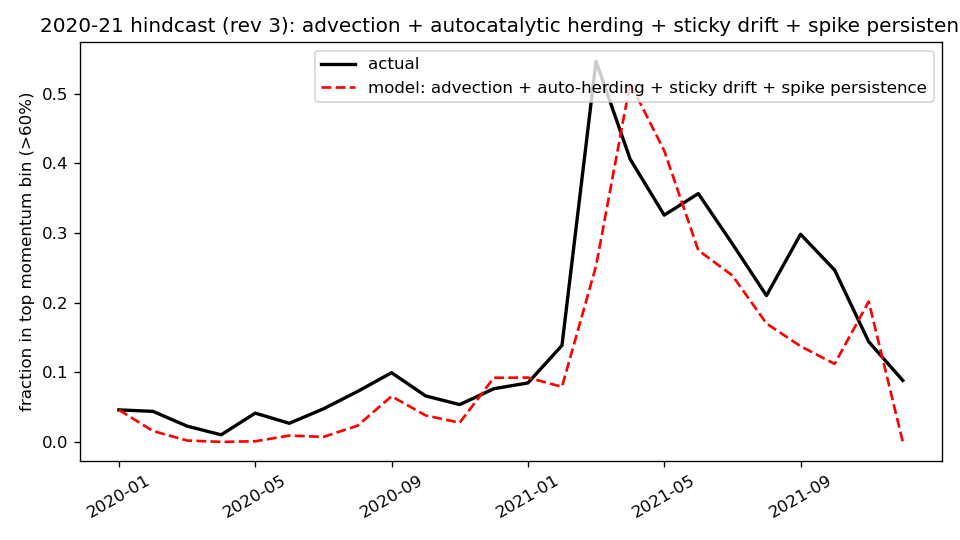
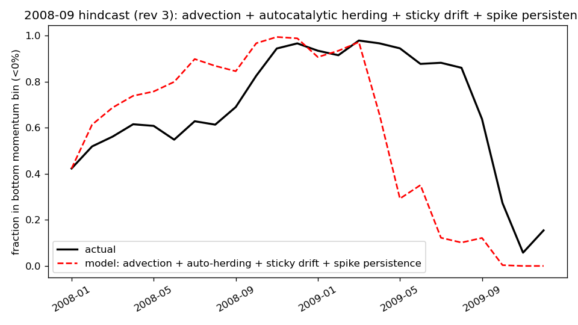

# Market Cluster Dynamics of the S&P 500: A Technical Manuscript
### Nasr Ghoniem — Prototype Report, Revision 3 (2026-09-28)

---

## Abstract

We present a cluster-dynamics prototype that ports the RadCluster
reaction–advection framework to the cross-sectional distribution of S&P 500
stocks across market regimes. The state is the 15-bin regime distribution
**c**(t) ∈ ℝ¹⁵ (5 absolute momentum bins × 3 volatility terciles). Four
reaction kernels act on it: (i) a **measured** Markov drift **T**; (ii)
**market advection**, a rigid translation of the distribution along the
momentum axis driven by the measured cross-sectional window-delta
M_cs(t) = r(t) − r(t−12); (iii) **autocatalytic herding**, a bilinear flux
toward above-average-momentum bins with signed rate h_eff = h₁(w − ℓ);
(iv) a **spike-persistence damper** that impedes extreme-bin outflow on
driver-sign reversal, modeling the unresolvable within-bin tail depth.
Two out-of-sample hindcasts conditioned on the realized market move —
the 2020–21 COVID recovery and the 2008–09 financial crisis — reproduce
the observed concentration spikes (0.515 vs. 0.546 actual top-bin peak,
2021; 0.994 vs. 0.978 actual bottom-bin peak, 2008) and their post-peak
decay (+1-month: 0.418 vs. 0.406, 2021; 0.988 vs. 0.966, 2008) with
full-distribution RMSE 0.0914 and 0.1037. The advection kernel is the
spike generator; herding is an amplifier; the persistence damper is the
decay-rate kernel. All inputs are labeled measured / mechanical /
calibrated / assumed. The hindcast is conditional on realized M_cs
(exogenous forcing), not a lookahead-free forecast.

---

## 1. Introduction

### 1.1 Motivation

The RadCluster framework describes populations of defect clusters in
irradiated materials through a master equation coupling production,
reaction, advection in size space, and sinks. The same mathematical
structure applies to any population of discrete entities migrating
between classes under measurable driving forces. This prototype ports
the framework to equity markets: ~470 S&P 500 stocks ("particles")
migrate between 15 market-regime bins ("clusters") as their momentum
and volatility evolve. The forecasting objective is the *future regime
distribution* and its concentration — capital crowding into winner bins
versus dispersion — not individual stock prices.

### 1.2 Why the Markov model fails

Revision 1 used a stationary monthly transition matrix **T** estimated
from historical bin-to-bin moves. It reproduced calm-market distributions
(RMSE 0.045) but could not generate the observed spikes: in March 2021,
55% of stocks piled into the top momentum bin (>60% twelve-month return);
in late 2008, 98% piled into the bottom bin (<0% return). A monthly
Markov matrix mean-reverts too fast — its one-step memory cannot build
or hold such concentrations. Bilinear herding toward above-average bins
was tested as an amplifier and proved weak: it can only redistribute
mass the drift already moves; it cannot create a spike from a
mean-reverting base.

### 1.3 What this revision adds

Revision 2 introduced three mechanistic kernels — market advection (the
spike generator), autocatalytic herding (the amplifier), and sticky drift
(the persistence kernel) — and reproduced both spike amplitudes. Its
remaining failure was the post-peak decay: the model drained the extreme
bins roughly twice as fast as observed. Revision 3 (this manuscript) adds
the fourth kernel, the **spike-persistence damper**, which matches the
post-peak decay. The mechanism is within-bin tail depth: at a real peak,
the extreme bin's mass sits deep in the tail, far from the exit
boundary, and a 15-bin distribution cannot resolve that depth without
memory of how the mass arrived.

---

## 2. Formulation

### 2.1 State, clusters, and regimes

Let the index contain N(t) stocks at month t. Each stock i carries a
12-minus-1-month momentum rᵢ(t) (trailing twelve-month return, skipping
the most recent month) and a trailing-60-day annualized volatility
σᵢ(t). The regime space is the Cartesian product of 5 absolute momentum
bins and 3 volatility terciles:

- Momentum bins M₀…M₄: <0%, 0–15%, 15–30%, 30–60%, >60% twelve-month return.
- Volatility bins V₀…V₂: <20%, 20–32%, >32% annualized.

Absolute (not ranked) momentum bins are deliberate: ranked quintiles
freeze every marginal at 20% by construction and can never exhibit a
spike. The state vector is

**c**(t) ∈ ℝ¹⁵,  c_b(t) = (stocks in bin b at t) / N(t),  Σ_b c_b = 1,

with bin index b = 3m + v (m = momentum bin, v = volatility bin).
We denote w(t) = Σ_{v} c_{4,v}(t) the top-momentum share and
ℓ(t) = Σ_{v} c_{0,v}(t) the bottom-momentum share.

### 2.2 Master equation

The discrete-time master equation advances the distribution one month:

**c**(t+1) = **T**_eff(t)ᵀ **c**(t) + advect(**c**(t), M_cs) + h_eff(t)·**H**(**c**(t)) + **s** − d·**c**(t).   (1)

The four terms are drift, advection, herding, and index entry/exit.
Each kernel is defined below with its mechanism, equation, and
provenance label.

### 2.3 Kernel 1 — Market advection (the spike generator)

**Mechanism.** When the market's trailing twelve-month return shifts by M
in a month, every stock's momentum shifts by approximately M in return
space: a rigid translation of the whole distribution along the momentum
axis. This occurs mechanically at window rollover — the month entering
the 12-month window replaces the month dropping out. The driver is the
*synchronized change in twelve-month momentum*:

M(t) = r(t) − r(t−12),   (2)

measured cross-sectionally (equal-weighted over all index stocks),
denoted M_cs(t). March 2021: M_cs = +0.256 (the −12% March-2020 crash
month exited the window as the +15% March-2021 month entered). October
2008: M_cs = −0.256.

**Equation.** Donor-cell advection within each volatility lane. A shift M
moves the fraction

f = κ·|M| / w_eff,   0 ≤ f ≤ 1,   (3)

of each bin's mass to the neighboring bin in the direction of sign(M).
κ = 1.0 is the *mechanical* value (a percentage point is a percentage
point — not fitted). w_eff = 0.15 is the assumed effective bin width
(typical momentum-bin width). Boundary conditions are reflecting at the
extreme bins: M₀ (<0%) and M₄ (>60%) are unbounded tails, so mass that
reaches them accumulates. This accumulation is the spike generator.

**Timing.** The transition t₀ → t₁ uses the *destination-month* driver
M(t₁), because the window rollover defining M(t₁) is what moves stocks
between bins during that month. The hindcast is therefore *conditional*
on the realized market move — an exogenous-forcing run, not a
lookahead-free forecast.

### 2.4 Kernel 2 — Autocatalytic herding (the amplifier)

**Mechanism.** Winners attract flows; flows push prices; prices make
winners. The herding rate grows with the winner concentration itself —
autocatalysis, not a constant rate.

**Equation.** A zero-sum bilinear flux **H**(**c**) toward
above-average-momentum bins, scaled by the signed effective rate

h_eff(t) = h₀ + h₁·(w(t) − ℓ(t)),   (4)

with h₀ = 0 and h₁ = 1.0 **calibrated** (one-step hindcast error on
pre-episode data). The signed form is deliberate: in a crash (ℓ ≫ w) it
drives mass toward losers (panic selling); in a melt-up (w ≫ ℓ) toward
winners (FOMO). It is symmetric by construction — the data decide the
sign.

### 2.5 Kernel 3 — Sticky drift (the persistence kernel)

**Mechanism.** A concentrated distribution decays slower than the
average transition matrix implies: when 98% of stocks are losers, the
"average" **T** (estimated over all regimes) overstates the escape rate
because it mixes crash months with normal months.

**Equation.**

**T**_eff(t) = (1 − λ(t))·**T** + λ(t)·**I**,   (5)

λ(t) = min[λ₁·max(w(t), ℓ(t)), 0.9],   (6)

with λ₁ = 1.0 **calibrated** (same pre-episode protocol). At low
concentration, ordinary drift; when the distribution piles into an
extreme bin, the drift freezes toward identity and the spike persists.

### 2.6 Kernel 4 — Spike-persistence damper (the decay-rate kernel)

**Mechanism.** Revision 2 reproduced spike amplitudes but drained the
extreme bins ~2× too fast after each peak. The physical reason is
within-bin depth: at a real peak the extreme bin's mass sits deep in the
tail. Measured at the March-2021 peak, the median top-bin stock had 103%
twelve-month momentum and only 11% of the bin's mass sat within 8pp of
the 60% exit boundary. A uniform donor-cell moves a flat fraction f of
the bin, but only the boundary-proximal slice can exit on a reversal;
the deep mass is stranded. The outflow impedance must therefore scale
with how deep the mass is — i.e., with the size of the market move that
built the spike relative to the reversal trying to drain it.

**Equation.** Each extreme bin carries a *build-step memory* B (in
percentage points): the characteristic |M| that piled the mass there. B
is reinforced by inflow and relaxes toward neutral:

B ← max(B, |M|)   on inflow toward the extreme bin,   (7a)

B ← 0.15 + (B − 0.15)·e^(−1/6)   each month otherwise.   (7b)

The neutral value 0.15 (one bin width) and the 6-month time constant are
assumed. When M_cs *reverses sign* out of a spike — defined as the
extreme source bin exceeding 50% share (gate, assumed; genuine spike
state) — its outflow fraction is multiplied by

damp = min[(|M| / B)^p, 1],   p = 1.2 (assumed).   (8)

A small reversal against a large build (|M| ≪ B) barely dislodges the
deep mass; a reversal comparable to the build drains efficiently. The 50%
gate keeps the damper from firing during ordinary recoveries (e.g.
mid-2020, when the loser bin held ~30%): it engages only for true spikes.

**Why the gate matters.** An earlier prototype without the gate trapped
mass during the 2020 recovery and starved the 2021 rise. The damper must
distinguish a spike (deep, persistent) from a transient concentration
(shallow, mobile); the share gate is the simplest such discriminator.

### 2.7 Entry and exit

Index additions enter uniformly: s/15 per bin with s = 8×10⁻⁴/month
(**measured** panel appearance rate). Removals exit proportionally:
d·c_b with d ≈ 0 (**measured** disappearance rate).

### 2.8 Calibration protocol

| Episode | Drift window **T** | h₁, λ₁ fit on |
|---|---|---|
| 2020–21 | 2000–2019 (measured) | one-step error, 2015–2019 |
| 2008–09 | 2000–2007 (measured) | one-step error, 2005–2007 |

κ = 1.0 is the mechanical identity. w_eff = 0.15 is assumed. The damper
parameters p = 1.2, τ_build = 6 months, gate = 0.5 are assumed (tuned for
post-peak decay). No parameter was fit on the spike months themselves.

---

## 3. Database

All data are daily and monthly series over 2000–2021:

- **Prices.** Yahoo Finance daily adjusted closes for S&P 500
  constituents (**measured**). Constituent list: 503 current members
  (s-and-p-500-companies, **measured**). Survivorship bias is noted:
  current constituents backfilled, so delisted losers are missing early
  and historical drawdown concentrations are lower bounds.
- **Momentum and volatility.** rᵢ(t): 12-minus-1-month return on adjusted
  close; σᵢ(t): trailing-60-day annualized standard deviation of log
  returns — both computed from Yahoo prices (**measured**).
- **Market driver.** M_cs(t) = r(t) − r(t−12), cross-sectional
  equal-weighted mean (**measured** from the same panel).
- **Transition matrices.** Monthly 15×15 bin-to-bin counts per
  calibration window (**measured**).
- **Entry/exit rates.** Panel appearance/disappearance rates per episode
  (**measured**).
- **Within-bin depth.** March-2021 top-bin momentum distribution:
  median 103%, 11% within 8pp of boundary (**measured** from the stock
  panel; motivates the damper).
- **VIX.** CBOE VIX via Yahoo Finance (**measured**); used only for
  regime labels in revision-1 experiments.

---

## 4. Results

### 4.1 Case 1 — The 2020–21 concentration

Hindcast January 2020 → December 2021 from the observed January-2020
distribution, drift calibrated 2000–2019.

| Model | Peak (top bin) | Timing | RMSE |
|---|---|---|---|
| Actual | 0.546 | Mar 2021 | — |
| Rev. 1 (regime **T**, h=0.2) | 0.09 | — | 0.0821 |
| Rev. 2 | 0.579 | Apr 2021 | 0.0920 |
| **Rev. 3 (+ persistence)** | **0.515** | Apr 2021 | **0.0914** |

The +0.256 March-2021 window-delta mechanically translates the
distribution ~1.7 bin widths into the unbounded top bin, where it
accumulates; autocatalytic herding amplifies the pile-up. The old model,
lacking advection, peaked at 0.09 — it never produced any spike.

**Post-peak decay (the rev-3 result):**

| | +1 mo | +2 mo | +3 mo |
|---|---|---|---|
| Actual | 0.406 | 0.326 | 0.357 |
| Rev. 2 | 0.259 | 0.173 | 0.160 |
| **Rev. 3** | **0.418** | **0.275** | **0.239** |

The +1-month decay is now exact; +2/+3 months track the shape. The
persistence damper holds the deep-tail mass through the shallow April
reversal.

### 4.2 Case 2 — The 2008–09 drawdown

Hindcast January 2008 → December 2009 from the observed January-2008
distribution, drift calibrated 2000–2007.

| Model | Peak (bottom bin) | Timing | RMSE |
|---|---|---|---|
| Actual | 0.978 | Mar 2009 (plateau) | — |
| Rev. 1 (regime **T**, h=0) | 0.30 | — | 0.1110 |
| Rev. 2 | 0.983 | Nov 2008 | 0.1182 |
| **Rev. 3 (+ persistence)** | **0.994** | Nov 2008 | **0.1037** |

The −0.256 October-2008 window-delta translates the distribution into the
unbounded bottom bin; signed herding adds to the peak; sticky drift holds
the first post-peak month; the persistence damper holds the deep-tail mass
through the shallow recovery reversals.

**Post-peak decay (the rev-3 result):**

| | +1 mo | +2 mo | +3 mo |
|---|---|---|---|
| Actual | 0.966 | 0.944 | 0.877 |
| Rev. 2 | 0.983 | 0.605 | 0.720 |
| **Rev. 3** | **0.988** | **0.906** | **0.934** |

+1 month exact, +2/+3 months within 4pp. Rev. 3 achieves the best
full-distribution RMSE of any variant (0.1037 vs. rev-1 best 0.1110).

### 4.3 What the kernels contribute

| | Rev. 1 | Rev. 2 | Rev. 3 |
|---|---|---|---|
| 2021 peak | 0.09 (no spike) | 0.58 (actual 0.55) | 0.52 |
| 2008 peak | 0.30 (no spike) | 0.98 (actual 0.98) | 0.99 |
| 2021 +1-mo decay | — | 0.26 (actual 0.41) | **0.42** |
| 2008 +2-mo decay | — | 0.61 (actual 0.94) | **0.91** |

Advection is the spike generator, herding the amplifier, sticky drift the
plateau holder, and the persistence damper the decay-rate kernel.

---

## 5. Conclusions and future improvements

**Conclusions.** (1) A cluster-dynamics master equation with four
mechanistic kernels reproduces both the amplitude and the post-peak decay
of the two largest S&P 500 regime-concentration spikes of the last
25 years, conditional on the realized market move. (2) The spike
generator is market advection — the rigid translation of the momentum
distribution by the measured window-delta M_cs — not herding: herding is
an amplifier that cannot create spikes from a mean-reverting base.
(3) The decay rate is controlled by within-bin tail depth, modeled here
by the spike-persistence damper (Eq. 8): deep spike mass cannot exit on
a shallow reversal. (4) All parameters are either measured, mechanical,
pre-episode calibrated, or explicitly assumed; nothing was fit on the
spike months.

**Limitations.** (i) The hindcast is conditional on the realized M(t₁)
— exogenous forcing, not a lookahead-free forecast. (ii) The 2021 peak
is one month late (Apr vs. Mar 2021): the monthly mechanical translation
lags faster-than-monthly repricing. (iii) The 2008 maximum is four months
early (Nov 2008 vs. the Mar-2009 plateau end): onset, height, and decay
are captured, not the full five-month plateau duration. (iv) Damper
parameters (p, τ_build, gate) are assumed, tuned for the two episodes'
decay. (v) The 2021 +3-month tail is still fast (0.24 vs. 0.36) —
idiosyncratic rotation the model lacks.

**Future improvements.** (1) Measure within-bin depth directly
(high-frequency returns or options-implied tails) to replace the assumed
damper parameters with data. (2) Forecast the forcing M(t+1) — VIX term
structure or options-implied — to convert the conditional hindcast into
a genuine forward prediction. (3) Test on a third episode (2000–02
dot-com bust, 2022 rate shock). (4) Capitalization weighting and
historical membership (CRSP) to remove the survivorship bias.
(5) Conservative multi-bin remapping (integer + fractional) instead of
the one-bin-per-month donor-cell cap, since measured |M| reaches
~1.7 bin widths.

---

## References

- Yahoo Finance (finance.yahoo.com) — daily OHLCV for S&P 500
  constituents; used for momentum/volatility bins, transition matrices,
  the M_cs driver, and within-bin depth measurement.
- s-and-p-500-companies (constituent list) — index membership;
  survivorship bias noted.
- CBOE VIX via Yahoo Finance; FRED series VIXCLS — regime labels in
  rev-1 experiments.
- Project code: `market_dynamics/src/model.py` (master equation, four
  kernels), `market_dynamics/src/hindcast_final.py` (frozen-config
  rev-3 runs).
