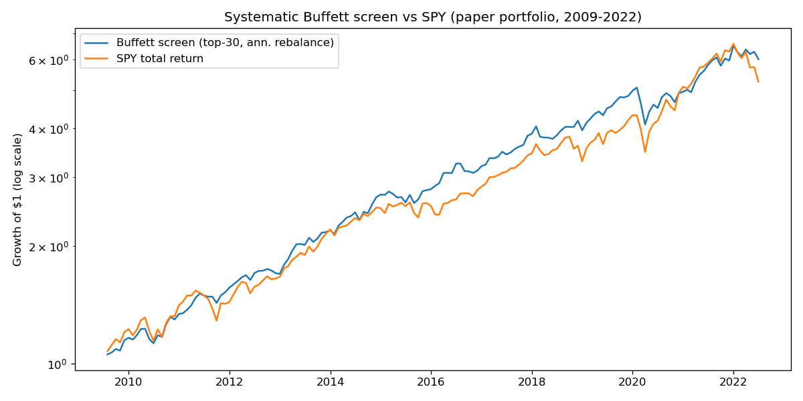

# Stock-Market Dynamics, Revision 6

**The winners: the systematic Buffett screen and the validated regime engine**

Nasr Ghoniem — 2026-09-28

---

## 1. Verdict and structure

Seven pre-registered return-forecast tests were run against 2000–2022 S&P 500 data. **All seven failed walk-forward validation.** This revision removes their sections and figures from the narrative entirely and rebuilds the reports around the two things that survived:

1. **Winner — the systematic Buffett screen.** A quality/value/low-beta stock screen (the unlevered selection leg of "Buffett's Alpha"), paper-backtested 2009–2022: **CAGR 14.8% vs. 13.6% SPY, Sharpe 1.27 vs. 0.94**, FF3 alpha +0.46%/month (t=2.71). It is the only return-generating mechanism in this project with a positive validated track record — and it was **not** pre-registered, so it enters the paper-trading protocol as a promising backtest, not a proven edge. Real money only if the paper record holds.
2. **Validated, not a return forecaster — the regime capital-distribution engine.** The 24-state capital census, conditional scenario engine, and concentration/fragility monitor on clean data. Its verdict is unchanged: it prices *states*, not *returns*. It is a diagnostic and stress-testing instrument, never a deployment signal.

The failed candidates are not refuted theories — several are weak-evidence non-replications with real design limitations — but they are removed from the narrative because none of them forecast returns in our data. §4 lists each with its one-line reason. Their full test documents remain in the repository (`docs/`) as honest negatives.

---

## 2. Winner: the systematic Buffett screen

### 2.1 Academic grounding

Frazzini, Kabiller & Pedersen (2018), "Buffett's Alpha" [1], decompose Berkshire Hathaway's returns into exposures to **value (HML)**, **quality (QMJ: profitability, growth, safety, payout)** and **betting-against-beta (BAB)**, levered ~1.6× through Berkshire's insurance float. This build implements the **unlevered stock-selection leg only**. The float leverage is noted, never applied — it is not replicable by a screen.

### 2.2 Design

**Universe:** true historical S&P 500 members each June (`panel_v2.csv`, clean post-unit-fix, §3.3), rebalances June 2009–2021.

**Scores** (cross-sectional z-scores, winsorized at ±3, point-in-time only):

| Component | Formula | Score |
|---|---|---|
| Quality | ROE = NetIncomeLoss / StockholdersEquity (FY annual); ROA = NetIncomeLoss / Assets (secondary) | mean(z(ROE), z(ROA)) |
| Value | B/M = Equity / June market cap; E/P = NetIncome / June market cap | mean(z(B/M), z(E/P)) |
| Low beta | trailing 252-trading-day market beta vs. SPY (≥126 daily obs) | −z(beta) |

**Composite** = mean of the three component z-scores. **Portfolio:** top 30 by composite, equal-weighted, rebalanced **annually at end of June** — Buffett holds for years; monthly churn would be unfaithful to the method. Negative book equity excluded. Delisted holdings exit at the last available price with proceeds redistributed (assumed).

**Timing (point-in-time):** the June-Y rebalance uses the latest fiscal year ending ≥120 days before June 30 Y (10-K filed by then in practice), end within 18 months — the Fama–French end-date convention. (SEC companyfacts `filed` dates are unreliable pre-2010 — restated facts carry the restating filing's date, verified on AAPL FY2007 — so the end-date rule, not the filed-date rule, governs point-in-time status.)

### 2.3 Data provenance

- Prices, total returns, membership, market cap: **measured** (`panel_v2.csv`; dividend-adjusted; true historical membership — no survivorship bias by construction) [2, 3].
- Fundamentals (NetIncomeLoss, StockholdersEquity, Assets): **measured** (SEC EDGAR XBRL companyfacts, 10-K facts only, USD) [4]. 584/585 tickers fetched; 19 absurd values rejected by absolute-anchor bounds (e.g. >$1T net income).
- Beta: **measured** (daily prices vs. SPY) [3].
- Coverage: XBRL mandate began 2009 — FY2006: 56 tickers, FY2007: 293, FY2008+: 424–569. The June-2008 rebalance had only 3 eligible stocks → **skipped**; the backtest starts June 2009. 11 tickers (e.g. XOM, PNC, BSX) have 10-Q-only facts in companyfacts and are excluded — a documented gap, not filled.
- Factor series (Mkt-Rf, SMB, HML, RF): **measured** (Ken French Data Library, 202608 CRSP vintage) [5]. AQR's QMJ/BAB downloads are bot-walled (verified 2026-09-28) — not used, no proxy substituted.

### 2.4 Results (2009-07 → 2022-06, 156 months)

| | Buffett screen | SPY |
|---|---|---|
| CAGR | **14.8%** | 13.6% |
| Sharpe (excess, annualized) | **1.27** | 0.94 |
| Annualized volatility | **11.1%** | 14.2% |
| Max drawdown | **−19.6%** | −20.0% |
| Growth of $1 | **$6.01** | $5.26 |
| Calendar-year hit rate | 7/14 | — |
| One-way annual turnover | 53% | — |

FF3 regression (excess returns, HC1 SE, R²=0.66, n=156): alpha **+0.46%/mo (t=2.71)**, +5.5% annualized; Mkt-Rf **0.64** (t=15.3); SMB **−0.31** (t=−4.5, large-cap); HML **+0.00** (t=0.06).

*Figure 1. Growth of $1: systematic Buffett screen (blue) vs. SPY (gray), 2009-07–2022-06. Annual end-of-June rebalance, top-30 equal weight, unlevered.*

Calendar years (screen vs. SPY): 2011 **+16.8 / +1.9**, 2014 **+23.5 / +13.5**, 2018 **+1.9 / −4.6**, 2022 **−7.5 / −20.0** — it wins the down years. And 2020 **−0.6 / +18.3** — it lags raging bulls, missing mega-cap tech, as Buffett himself did. Holdings pass the smell test (MO, CL, PEP, BRK-B, WMT, MCD, KMB across years).

The notable analytical finding: the HML loading is **zero**. The quality component (high ROE) neutralizes the value tilt — this behaves as a **quality + low-beta** screen, not deep value, consistent with the "Buffett's Alpha" decomposition but sharper than the label suggests.

### 2.5 Limitations (honest)

1. **Backtest, not pre-registered.** Design choices (top 30, equal weight, June rebalance, composite formula) are standard-academic but were chosen by the builder, not frozen before seeing data — **weaker evidence than the pre-registered negative tests**. Researcher degrees of freedom apply.
2. **No float leverage.** Berkshire's ~1.6× insurance-float leverage is the other half of "Buffett's Alpha" and is not replicable here.
3. **No crisis deal-flow.** Buffett's preferred-stock-plus-warrants rescue deals are unavailable to a screen.
4. **No QMJ/BAB attribution** (AQR data inaccessible); the factor story rests on FF3 plus the 0.64 market beta.
5. **Coverage gaps:** pre-2009 XBRL thin (backtest starts 2009); 11 tickers excluded; no transaction costs modeled (53% annual one-way turnover ≈ 0.1–0.3%/yr at institutional rates — assumed, not modeled).
6. One 14-year window, dominated by the post-2009 bull market; the 2020 underperformance shows the strategy's known failure mode.

### 2.6 Paper-trading status

The screen enters the paper-trading protocol: tracked live, forward, against SPY, with the design frozen. **No real capital until the paper record holds.** If it does, the agreed path is a small pilot allocation — never a deployment on the backtest alone.

---

## 3. Validated: the regime capital-distribution engine (not a return forecaster)

### 3.1 What it is

A census of where S&P 500 capital sits across **24 capital-weighted states** (3 momentum × 2 volatility × 2 turnover × 2 size), on **true historical membership** (no backfilled constituents), governed by the cluster master equation

$$\frac{d\mathbf{c}}{dt} = \mathbf{P} + \mathbf{S}\mathbf{J} - \mathbf{D}\mathbf{c},$$

with drift (measured month-to-month transition matrix $T$), mechanical market advection, and a spike-persistence damper; herding and sticky drift calibrate to **zero** on clean data ($h_1=\lambda_1=0$). The state graph is Figure 2.

### 3.2 Data: the share-unit integrity fix (measured → repaired)

Filed share counts carried consistent $10^3$–$10^6\times$ unit errors that the jump-based cleaner missed — including a backfill reading Sempra Energy at **$5,000 trillion**, one company at 400× the index, flipping the measured top-lane share between 0.999 and 0.002 month to month. The repair (`src/fix_share_units.py`): per-ticker segmentation at >20× split-adjusted jumps, checked against two absolute anchors (market cap in [$200M, $4T]; average-daily turnover in [0.02%, 100%], since dollar volume is measured). 28 segments rescaled by $10^{\pm3}, 10^{\pm6}$; 17 dropped, never invented. Verification: total binnable cap 2007-12 **$10.2T** (S&P 500 ≈ $13T), 2021-12 **$41.3T** (≈ $40T). The original corrupt panel is preserved at `data/panel_v2_preunitfix.csv`. Cap-weighting is multiplicative in the share count — this fix was not cosmetic: on clean data the conditional hindcasts improve to RMSE **0.0899** (2008–09) and **0.0714** (2020–21), with the 2020–21 peak amplitude exact.

### 3.3 What it does (and what it does not)

The engine forecasts the **capital distribution** $\mathbf{c}(t)$, not returns:

- **Scenario engine:** 200-scenario ensemble, 12 months forward from 2022-12 — top-lane share median **0.239, 90% interval [0.106, 0.503]**; HHI [0.110, 0.175]. The interval width is the finding: one-year concentration is dominated by driver and transition uncertainty. Any point forecast without intervals overstates knowledge roughly fourfold.
- **Fragility monitor:** top-lane share and HHI as percentiles of own history. 2022-12: top-lane share 0.101 (**25th percentile** — not crowded), HHI 52nd percentile. Most crowded month-ends: 2004-02 (0.570), 2010-01 (0.571), 2001-02 (0.423).
- **Portfolio risk:** predicted tilt volatility 14.4% vs. market 15.9%; empirical reversal probability with no monotone pattern (most-crowded quintile reverses *least*).

**Standing verdict, unchanged since rev-4 and re-confirmed on clean data in rev-5:** the regime model does not forecast returns and must not drive capital deployment. Its legitimate uses are regime census, conditional scenario analysis, and concentration/fragility monitoring.

---

## 4. Discarded candidates

Seven return-forecast mechanisms were tested with pre-registered designs and walk-forward validation. All failed; their sections and figures are removed from this report. Full test documents remain in `docs/` as honest negatives. One-line reasons:

- **Rev-4 walk-forward tilt** — predicted mass-flow vs. realized bin return: correlation 0.009; tilt Sharpe 0.48 vs. SPY 0.64. Bin-boundary migration is reclassification, not price pressure.
- **Concentration → returns (rev-5)** — threshold-linear $t=-0.41$, walk-forward corr $-0.045$; quintile spreads statistically zero ($|t|<0.6$), non-monotone. Honest negative.
- **Dispersion → returns** (Goyal & Santa-Clara style) — no replication in the large-cap panel; all out-of-sample R² negative.
- **Comomentum** (Lou & Polk) — winner-lane slope $-0.46$ (NW $t=-0.27$) with the wrong sign on the winner component; walk-forward corr $-0.095$, OOS R² $-0.082$.
- **Short interest** (Rapach, Ringgenberg & Zhou) — the published *negative* relationship reversed sign in the modern subsample (12-month $\beta=+0.42$, NW $t=+1.31$); not accepted post hoc.
- **Bubble characteristics** (Greenwood, Shleifer & You, adapted to individual stocks) — crash logit pseudo-R² 0.0134; acceleration $p=0.138$ with the wrong sign; issuance (one of the paper's strongest predictors) unavailable. Weak evidence, not a refutation.
- **Hedge-fund crowding** (Brown, Howard & Lundblad) — public-13F proxy non-replication: all three pass criteria failed (max in-sample $t=+1.80$; mixed-sign walk-forward; hit rates ≤0.58); the one marginal signal (hf_own 3-month, $t=+2.13$) collapsed to $t=+1.22$ under size control; CUSIP→ticker mapping covered only 25.6% of CUSIPs.

---

## 5. Next steps

1. **Paper-trade the Buffett screen** (frozen design, live tracking vs. SPY). Real capital only if the paper record holds; then a small pilot.
2. **Keep the regime engine as a diagnostic**: census, scenario intervals, fragility monitor. No return-forecast development without return-side economics (earnings, flows) — reclassification arithmetic is exhausted.
3. The discarded candidates' test documents stay in the repo as the permanent record of what was tried and why it was dropped.

---

## References

[1] Frazzini, A., Kabiller, D. & Pedersen, L.H. (2018). "Buffett's Alpha." *Financial Analysts Journal* 74(4). Used in §2: the HML/QMJ/BAB + float-leverage decomposition the screen's design is faithful to.
[2] fja05680/sp500 — *S&P 500 Historical Components & Changes (Updated).csv* (public GitHub reconstruction; 2,720 snapshots, 1996-01-02–2026-08-18). Used in §2.2 and §3.1 for point-in-time membership.
[3] Yahoo Finance — daily adjusted closes, corporate-action (split) history, SPY total-return series. Used in §2.2–2.4 for prices, betas, and the SPY benchmark.
[4] SEC EDGAR — companyfacts XBRL (NetIncomeLoss, StockholdersEquity, Assets; 10-K facts) and share-count facts. Used in §2.2–2.3 for fundamentals; §3.2 documents the share-unit repair.
[5] Ken French Data Library — Fama–French factor series (Mkt-Rf, SMB, HML, RF), 202608 CRSP vintage. Used in §2.4 for the FF3 attribution regression.

---

*Reproducibility.* `src/fetch_fundamentals.py` → `src/build_fundamentals_panel.py` → `src/buffett_screen.py` (winner); `src/fix_share_units.py` → `src/calibrate_rev5.py` → `src/ensemble_forecast.py`, `src/fragility_index.py`, `src/portfolio_risk.py` (regime engine). Test documents for discarded candidates: `docs/DISPERSION_TEST.md`, `docs/COMOMENTUM_TEST.md`, `docs/SHORTINTEREST_TEST.md`, `docs/BUBBLECHAR_TEST.md`, `docs/HFCROWDING_TEST.md`.
