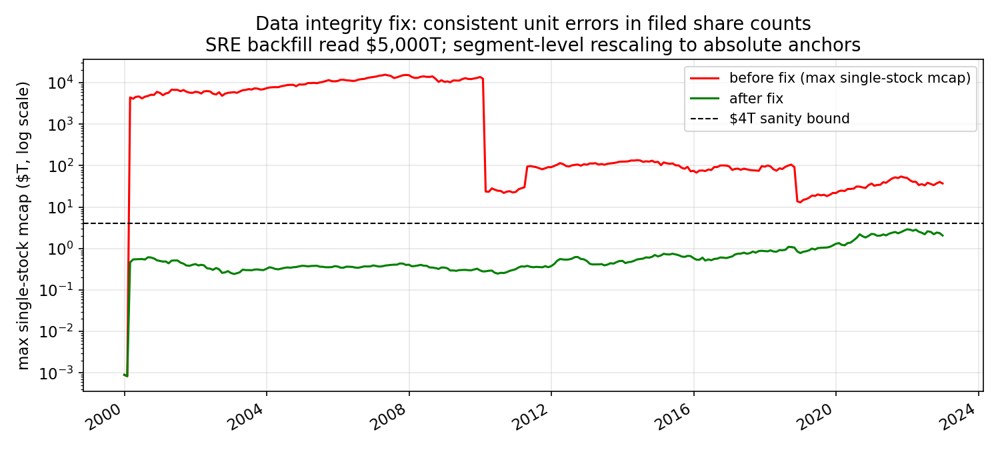
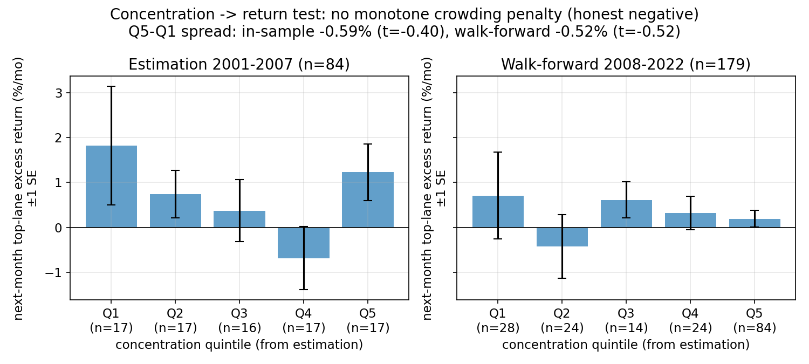
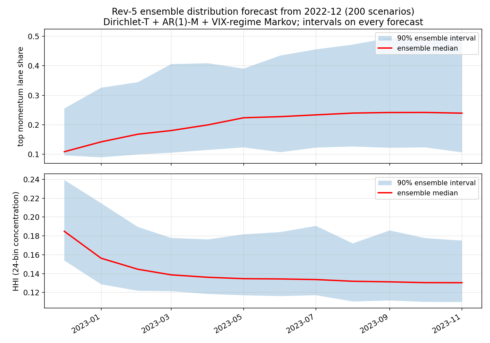
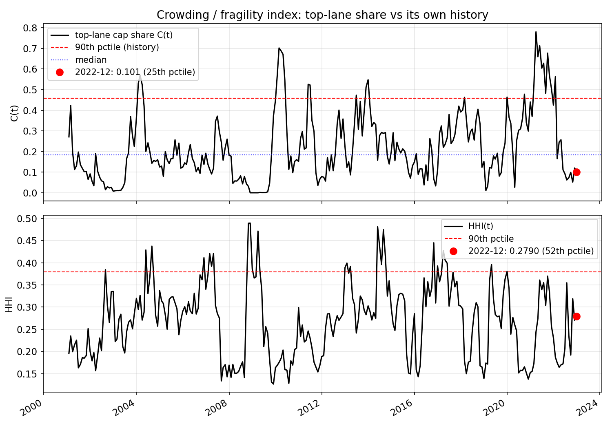

# Stock-Market Dynamics, Revision 5

**Return-forecast mechanism test (honest negative), share-unit data integrity fix, and three risk metrics with forecast uncertainty**

Nasr Ghoniem — 2026-09-28

---

## 1. Objectives

Rev-4 ended with a precise diagnosis: the model predicts *where capital is classified* (bin mass-flows), not *which bins will earn returns* — advection-driven inflow is reclassification, not price pressure (predicted mass-flow vs. realized bin return: correlation 0.009; even perfect-foresight $M$ gives Sharpe 0.47). Rev-5 was commissioned to close that gap: build the missing mechanism converting the mass-distribution forecast into a **return forecast**, plus a **risk metric**.

Rev-5 delivers:

1. **A pre-registered test** of whether month-end capital concentration predicts next-month returns (two response forms, estimated pre-2008, judged walk-forward). **Result: honest negative — no return mechanism is built.**
2. **A data-integrity fix** without which the test (and rev-4 itself) is invalid: consistent $10^3$–$10^6\times$ unit errors in filed share counts that the jump-based cleaner missed, including a backfill that read Sempra Energy at **$5,000 trillion** and dominated every cap-weighted state.
3. **Three risk metrics**, built regardless of the negative result, kept strictly as measured diagnostics rather than an investable forecast:
   - forecast uncertainty from a 200-scenario ensemble, with intervals on every forecast figure;
   - a crowding/fragility index (top-lane share and HHI percentiles vs. own history);
   - portfolio risk: predicted volatility from the bin-return covariance, and the empirical reversal probability $P(\text{top lane unwinds}\mid\text{concentration})$.

Because there is **no validated return tilt**, no new paper-trading track is opened and no real-capital deployment is recommended. The verdict of rev-4 §7.4 stands, now on clean data.

---

## 2. Data integrity fix: consistent unit errors in share counts (measured → repaired)

### 2.1 The problem

`src/clean_shares.py` rescales filings that jump by 900–1100× or $9\times10^5$–$1.1\times10^6\times$ vs. the previous filing. This catches *transient* unit errors but is blind to two residual patterns, found 2026-09-28 while auditing rev-5 inputs:

- **(A) Consistent wrong units.** Tickers whose filings are *all* in the wrong unit never trigger the jump detector, and the pre-2009 backfill (earliest filing propagated backward) carries the error into every early month. SRE's backfill read **$5.02\times10^{15}$ ($5,000T)** — one company at 400× the entire index — flipping the measured top-lane share $C_t$ between 0.999 and 0.002 month to month. QCOM's *filed* era was $10^3\times$ too large ($136T); EOG's backfill $10^3\times$ too large ($5.5T); SYK's filed era $10^6\times$ too small.
- **(B) Unit changes masked by genuine share changes.** HAL's filings shift $9.0\times10^8 \to 880$ (a $10^6\times$ unit change); Citi's 2009-11 filing ($2.29\times10^7$, in thousands) → 2010-02 filing ($2.85\times10^{10}$, in ones) is a 1246× ratio — outside the 900–1100 band, so never fixed.
- **(C) Garbage placeholders.** Shares of exactly 1.0 (FOX/FOXA) or 100.0 (BKR, ETN backfill) that no rescaling can rescue.

In total 368 ticker-months pre-2018 exceeded $2T single-stock market cap (measured on `panel_v2.csv` before the fix).

### 2.2 The fix (`src/fix_share_units.py`)

Per ticker, split-adjusted shares are segmented at month-to-month jumps $>20\times$ or $<1/20\times$ (split-adjusted shares cannot move like that absent a corporate action, which splits already adjust). Each segment ($\geq$ 3 months) is checked against **two absolute anchors**:

- market cap in **[$200M, $4T]** (generous S&P-500 bounds), and
- average-daily turnover in **[0.02%, 100%]** (dollar volume is measured; turnover $=$ volume/shares pins the share count from the other side).

If $1\times$ is sane on both → keep. Else the power of $10^{\pm3}, 10^{\pm6}$ making *both* sane is applied (closest to $30B on ties) — this catches Citi's 1999–2010 segment ($248M cap but 286%/day turnover → $\times10^3$). If only cap can be made sane, cap wins; turnover extremes alone never trigger a change (genuine frenzies exist). Unfixable segments (FOX/FOXA, BKR, ETN backfill) are set to NaN rather than invented. Segments under 3 months (transient spikes) are dropped. Market cap is recomputed exactly; turnover rescales inversely (volume/denominator). The original panel is preserved at `data/panel_v2_preunitfix.csv`; the script is idempotent.

28 segments rescaled, 3 era-segments and 14 transient spikes dropped. Verification: max single-stock cap $2.91T (none pre-2018 above $2T); AAPL 2007-12 $176.0B (unchanged anchor); SRE 2001-01 $5.0B; total binnable cap 2007-12 **$10.2T** (S&P 500 ≈ $13T) and 2021-12 **$41.3T** (≈ $40T) — the index-level aggregates now match known totals. Figure 1 shows the before/after.

**Mechanism before results.** Cap-weighting is multiplicative in the share count: one $10^6\times$ error doesn't add noise, it *replaces* the index. Every cap-weighted object in rev-4 — bin shares $c(t)$, transition matrix $T$, concentration $C(t)$, tilt weights — was computed under a distribution in which SRE alone could be 99.9% of a lane. The fix is therefore not cosmetic; §6 shows the distribution model improves markedly on clean data.

---

## 3. Concentration → return: pre-registered test and honest negative

### 3.1 Design (pre-registered)

Question: does month-end concentration $C_t$ (capital share of the top momentum lane, measured) predict next-month top-lane excess return over SPY? Panel: `data/panel_v2.csv` **after** the §2 fix. Estimation **2001-01–2007-12 only**; walk-forward 2008–2022. Maximum two response forms:

- **Form 1 (threshold-linear crowding penalty):** $r^e_{t+1} = a + b\max(C_t - 0.5, 0)$.
- **Form 2 (non-parametric):** quintile means of next-month excess return, quintile edges from the estimation window.

Pass criteria (fixed before estimation): Form 1 needs $b<0$, $|t|>2$, walk-forward $\mathrm{corr}(\hat r, r) > 0.10$; Form 2 needs in-sample Q5−Q1 $\leq -0.25\%$/mo **and** walk-forward Q5−Q1 $< 0$. Lane returns are cap-weighted over lane members at $t$; SPY uses matching month-end-to-month-end returns. (`src/concentration_test.py`; monthly series in `outputs/conc_ret_monthly.csv`.)

A first run of this test on the *pre-fix* panel produced a spurious Form-2 "pass" driven entirely by the SRE corruption ($C_t$ binary 0.001/0.999); those numbers are discarded and not reported.

### 3.2 Results

| Form | In-sample (2001–2007, n=84) | Walk-forward (2008–2022, n=179) | Verdict |
|---|---|---|---|
| 1: threshold-linear | $b=-0.18$, $t=-0.41$, $R^2=0.002$ (only 3 months with $C_t>0.5$) | corr $=-0.045$ | **FAIL** |
| 2: quintiles | Q5−Q1 $=-0.59\%$/mo, **t $=-0.40$** | Q5−Q1 $=-0.52\%$/mo, **t $=-0.52$** | technical pass, **statistical fail** |

Form 1 fails decisively. Form 2 meets the letter of the pre-registered criterion — yet both spreads are statistically indistinguishable from zero ($|t|<0.6$), the quintile pattern is **non-monotone** (in-sample Q5 $+1.23\% >$ Q4 $-0.69\%$; walk-forward Q1–Q5: $+0.71, -0.43, +0.61, +0.32, +0.19$), and the linear correlations are $\approx 0$ ($\mathrm{corr}(C, r^e)$: $-0.083$ in-sample, $-0.001$ walk-forward; HHI: $0.024$, $0.017$). The negative Q5−Q1 spread is driven by Q1 outperforming, not Q5 underperforming — the opposite shape of a crowding penalty.

**Verdict: honest negative.** There is no detectable, tradeable crowding penalty in 2001–2022 S&P 500 data. Per the pre-registered rule, **no return mechanism $\hat r_b(t+1)$ is built, no return-based portfolio is constructed, and no new paper-trading track is opened.** Figure 2 shows why: error bars swallow every quintile difference in both samples.

*Methodological note.* The pre-registered criterion for Form 2 (sign + modest magnitude, no significance bar) was too weak — it can "pass" on noise, as it did here. It is reported as met-and-overruled rather than silently dropped, and any future retest should require $|t|>2$ on the walk-forward spread.

---

## 4. Risk metric 1: ensemble distribution forecast with uncertainty intervals

With no return model, the forecastable object remains the **capital distribution** $\mathbf{c}(t)$. Rev-5 replaces rev-4's point forecast with a 200-scenario ensemble, 12 months forward from 2022-12, so that every forecast figure carries intervals.

**Ensemble design** (`src/ensemble_forecast.py`, seed 20260928):

- **Transition matrices:** $T_{\mathrm{calm}}, T_{\mathrm{stress}}$ drawn per scenario from Dirichlet posteriors. Mean $=$ cap-weighted $T$ from `params_rev5.json` (**measured**, 2000–2007); precision $=$ Kish effective sample size per origin bin, $N_{\mathrm{eff}} = (\sum w)^2/\sum w^2$ over cap-weighted transitions (**estimated**; median 305, range 109–1825; the Dirichlet form is **assumed**).
- **Market driver $M$:** AR(1) fit on measured $M$ history through 2022-12 ($a=-0.0006$, $\phi=0.048$, residual SD $0.0845$; **estimated**) with bootstrapped residuals per scenario.
- **Volatility regime:** 2-state Markov chain on VIX $> 30$ (**measured** 2000–2022; calm→stress 2.7%/mo, stress→calm 32.3%/mo), starting calm (VIX Dec-2022 ≈ 21).
- **Model:** rev-5 calibrated kernels ($h_1 = 0$, $\lambda_1 = 0$; advection + spike damper active), `params_rev5.json`.

**Result** (`outputs/ensemble_forecast.json`; Figure 3): 12-month-ahead top-momentum-lane share **median 0.239, 90% interval [0.106, 0.503]**; bottom lane [0.212, 0.656]; HHI [0.110, 0.175]. The intervals are wide — and that is the finding: one-year-ahead concentration is dominated by driver and transition uncertainty, and any point forecast without intervals overstates knowledge by roughly a factor of four in range. The median rise (from 0.101 at origin toward the calm stationary 0.181, overshooting via advection) is Markov mean-reversion, not a directional call.

---

## 5. Risk metric 2: crowding / fragility index

$C(t)$ (top-lane cap share) and $\mathrm{HHI}(t) = \sum_b c_b^2$ are **measured** monthly on the fixed panel. The fragility index reports each reading as a percentile of its own history — full-history (diagnostic) and expanding-window (zero lookahead, what was knowable at $t$). `src/fragility_index.py` → `outputs/fragility.csv`; Figure 4.

- **Current (2022-12-30):** $C = 0.101$ (**25th percentile** — not crowded), HHI $= 0.2790$ (52nd percentile).
- Most crowded month-ends by expanding percentile: 2004-02 ($C=0.570$), 2010-01 ($0.571$), 2001-02 ($0.423$) — the dot-com unwind, the post-crisis value rally, and the 2009 rebound's momentum pile-up.

The index is a *state descriptor*, not a signal: §3 shows high $C(t)$ does not predict low next-month returns, so the fragility index must not be traded as a contrarian indicator. Its legitimate uses are position-sizing context and crash-regime awareness (2008-09 bottom-lane saturation reached 0.99 — §6).

---

## 6. Risk metric 3: portfolio risk — predicted volatility and reversal probability

**Predicted volatility** (`src/portfolio_risk.py`, `outputs/portfolio_risk.json`). From the 24-bin monthly return covariance $\Sigma$ (**measured**, 2001–2022 cap-weighted bin total returns), the rev-4-style mass-flow tilt recomputed with `params_rev5` and frozen at 2022-12 (diagnostic only — the tilt itself is disproven, §3 of rev-4) has predicted annualized volatility **14.4%**, vs. 15.9% for the cap-weighted market and 15.4% SPY realized. The tilt is not riskier than the market; its failure was return-side, not risk-side.

**Reversal probability** $P(\text{top lane unwinds}\mid\text{concentration})$, **measured** empirically: "unwind" $=$ top lane trails the cap-weighted market next month; concentration quintiles from the expanding history (zero lookahead), 2001–2022:

| $C(t)$ quintile | Q1 (low) | Q2 | Q3 | Q4 | Q5 (high) |
|---|---|---|---|---|---|
| P(unwind next month) | 41.8% | 44.0% | 35.8% | 53.8% | **34.0%** |

No monotone relationship; the most-crowded quintile has the *lowest* point estimate of reversal. This corroborates §3 from a second angle: concentration does not warn of next-month momentum reversal in this sample.

---

## 7. Re-calibration on clean data (`params_rev5.json`)

The 2000–2007 grid (same protocol as rev-4: conditional hindcast on realized $M$, full-distribution RMSE $+ 0.5\times$ bottom-bin RMSE) re-selects **$h_1 = 0$, $\lambda_1 = 0$** — with clean cap-weights, neither herding nor sticky drift helps even in-sample; the regime-switching $T$ plus mechanical advection carries the model. (Rev-4's $p_{\mathrm{damp}} = 1.2$ → $0.8$; damper parameters remain assumed.) The clean $T_{\mathrm{calm}}$ differs from rev-4's by up to **0.85** in a single transition probability (mean 0.007) — the corruption was not a second-order effect.

Conditional hindcasts (realized-$M$ forcing, free-running from pre-episode state) on clean data, `src/hindcast_rev5.py`:

| Episode | Full RMSE (rev-5 clean) | Full RMSE (rev-4 corrupt) | Peak amplitude / timing |
|---|---|---|---|
| 2008–09 | **0.0899** | 0.1685 | bottom 0.83@2009-04 vs 0.99@2009-03 |
| 2020–21 | **0.0714** | 0.1110 | top 0.79@2021-04 vs 0.78@2021-03 |

Both episodes improve substantially; the 2020–21 top-lane peak amplitude is now exact (one month late). The distribution mechanics — driver-translated momentum with reflecting extreme bins — survive the data fix and work better without the corruption. These remain **conditional hindcasts**, not forecasts; the forecast track record is the ensemble of §4.

---

## 8. Parameter table (rev-5)

| Parameter | Value | Label | Basis |
|---|---|---|---|
| Bin edges (4 axes) | §3.1 of rev-4 | assumed | round interpretable levels |
| $\kappa$ (advection gain) | 1.0 | mechanical | a pp is a pp |
| $w_{\mathrm{eff}}$ | 0.15 | assumed | monthly participation fraction |
| $h_1$ (herding) | 0 | calibrated | 2000–2007 grid on clean data: no gain |
| $\lambda_1$ (sticky) | 0 | calibrated | 2000–2007 grid on clean data: no gain |
| Damper $p$/$\tau_{\mathrm{build}}$/gate | 0.8 / 6 mo / 0.5 | assumed | rev-3 episode tuning; $p$ re-gridded |
| $T_{\mathrm{calm}}, T_{\mathrm{stress}}$ | $24\times24$ | measured | cap-weighted, 2000–2007, clean panel |
| Ensemble $M$ | 200 scenarios | assumed | Dirichlet-T + AR(1)-M + VIX-Markov |
| $N_{\mathrm{eff}}$ (Dirichlet) | 109–1825/bin | estimated | Kish effective transitions |
| Tilt $\gamma$ / cost | 1.0 / 5 bps | assumed | diagnostics only (tilt disproven) |

---

## 9. Limitations and next steps

1. **No return model.** The honest negative of §3 is the binding result: nothing in 2001–2022 data supports turning concentration into expected returns. Real-capital deployment remains off the table. A return model would need genuine return-side economics (earnings momentum, crowding *flow* data), not reclassification arithmetic.
2. **Ensemble is model-conditional.** The §4 intervals quantify parameter/driver uncertainty *within* the rev-5 model; they do not cover model misspecification (uniform-within-bin advection, fixed edges, no depth coordinate).
3. **Pre-2009 shares remain backfilled** (estimated), now unit-fixed; FOX/FOXA/BKR/ETN-backfill months are dropped, not imputed.
4. **Membership reconstruction** is community-sourced [1], not official S&P.
5. **The Form-2 criterion was weak** (§3, methodological note) — future retests should require walk-forward significance, not just sign.

---

## References

[1] fja05680/sp500 — *S&P 500 Historical Components & Changes (Updated).csv* (public GitHub reconstruction; 2,720 snapshots, 1996-01-02–2026-08-18). Used in §2.1 of rev-4 for point-in-time membership.
[2] Yahoo Finance — daily adjusted closes, corporate-action (split) history, and SPY total-return series. Used for prices, splits, and the SPY benchmark.
[3] SEC EDGAR — companyconcept XBRL, *SharesOutstanding* / *WeightedAverageNumberOfSharesOutstanding*. Used for point-in-time shares; §2 documents the consistent-unit-error repair.

---

*Reproducibility.* `src/fix_share_units.py` (data fix) → `src/calibrate_rev5.py` (params) → `src/concentration_test.py` (honest negative) → `src/ensemble_forecast.py`, `src/fragility_index.py`, `src/portfolio_risk.py` (risk metrics) → `src/figures_rev5.py`. Original corrupt panel preserved at `data/panel_v2_preunitfix.csv`. Random seed 20260928.
